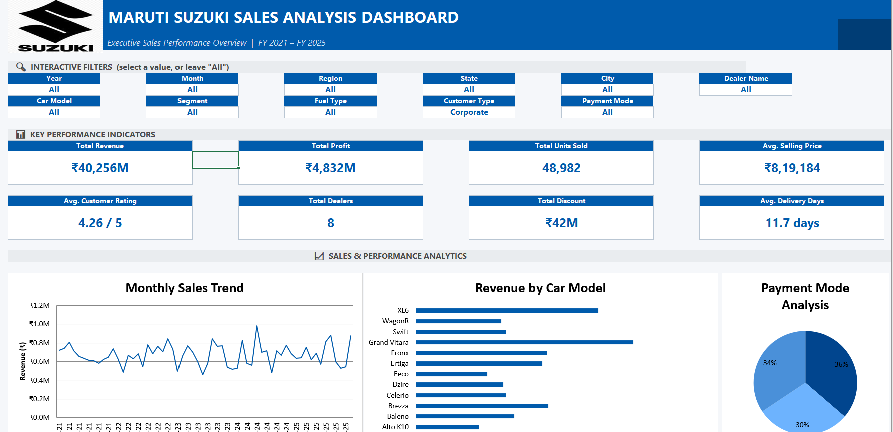
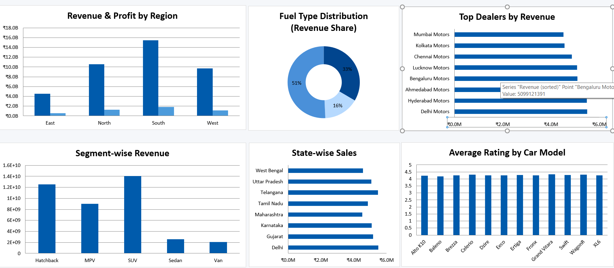

# 🚗 Maruti Suzuki Sales Dashboard (2021–2025)


## 📌 Project Overview

This project presents an **Interactive Maruti Suzuki Sales Dashboard** developed in **Microsoft Excel** to analyze the company's sales performance across India from **2021 to 2025**.

The dashboard transforms raw sales data into meaningful business insights using Pivot Tables, Pivot Charts, KPI Cards, Slicers, and Excel visualization techniques. It is designed to simulate an executive-level sales reporting dashboard commonly used in the automotive industry.

---

## 🎯 Project Objectives

- Analyze sales performance from 2021–2025
- Track revenue and profitability
- Identify top-performing car models
- Compare regional and state-wise sales
- Evaluate customer ratings and delivery performance
- Build an interactive dashboard using Excel

---

# 📂 Repository Structure

```
Maruti-Suzuki-Sales-Dashboard/
│
├── Dashboard/
│   └── Maruti_Suzuki_Sales_Dashboard_(2021-2025).xlsx
│
├── Dataset/
│   └── Maruti_Suzuki_Sales_2021_2025.xlsx
│
├── Images/
│   ├── Dashboard.png
│   ├── Charts.png
│   ├── KPI_Cards.png
│   └── Thumbnail.png
│
└── README.md
```

---

## 📊 Dashboard Preview

### Dashboard Overview



### Sales & Revenue Analysis



---

# 📈 Key Performance Indicators (KPIs)

The dashboard includes the following executive-level KPIs:

- 💰 Total Revenue
- 📈 Total Profit
- 🚗 Total Units Sold
- 💵 Average Selling Price
- ⭐ Average Customer Rating
- 🏢 Total Dealers
- 🎁 Total Discount
- 🚚 Average Delivery Days

---

# 📌 Dashboard Features

### Interactive Filters (Slicers)

- Year
- Month
- Region
- State
- City
- Dealer Name
- Car Model
- Segment
- Fuel Type
- Customer Type
- Payment Mode

---

## 📊 Charts Included

- Monthly Sales Trend
- Revenue by Car Model
- Revenue & Profit by Region
- Fuel Type Distribution
- Segment-wise Revenue
- State-wise Sales
- Top Dealers by Revenue
- Average Rating by Car Model
- Average Delivery Days by Region
- Payment Mode Analysis

---

# 📂 Dataset Information

The dataset contains synthetic sales data representing Maruti Suzuki vehicle sales between **2021 and 2025**.

### Dataset Columns

- Date
- Year
- Month
- Region
- State
- City
- Dealer Name
- Car Model
- Segment
- Fuel Type
- Units Sold
- Selling Price
- Revenue
- Discount
- Profit
- Customer Type
- Payment Mode
- Rating
- Delivery Days

---

# 🛠 Tools Used

- Microsoft Excel 2021
- Pivot Tables
- Pivot Charts
- Slicers
- Conditional Formatting
- KPI Cards
- Excel Formulas
- Data Cleaning
- Dashboard Design

---

# 📊 Business Insights

The dashboard helps answer questions such as:

- Which car model generates the highest revenue?
- Which region contributes the most sales?
- What is the monthly sales trend?
- Which states perform best?
- Which dealers generate the highest revenue?
- How do different fuel types contribute to revenue?
- What is the average customer satisfaction rating?
- How does payment mode distribution vary?

---

# 🎨 Dashboard Design Highlights

- Corporate Blue Theme inspired by Maruti Suzuki
- Interactive user experience
- Executive-level KPI cards
- Clean layout with balanced spacing
- Professional typography
- Dynamic filtering using slicers
- Fully presentation-ready dashboard

---

# 📌 Learning Outcomes

Through this project, I gained hands-on experience in:

- Data Cleaning
- Dashboard Design
- Business Analytics
- KPI Development
- Data Visualization
- Excel Automation
- Interactive Reporting
- Sales Analysis

---

# 🚀 Future Improvements

- Power Query Automation
- Power Pivot Data Model
- Dynamic Timeline Slicer
- Forecasting Dashboard
- Sales Target vs Achievement Analysis
- Dealer Performance Scorecards
- Customer Demographics Dashboard
- Mobile-friendly Dashboard Layout

---

# 👨‍💻 Author

**Jai Bhagwan**

**Data Analyst**

### Connect with me

* **LinkedIn:** https://www.linkedin.com/in/jai-bhagwan-3a0891214/
* **GitHub:** https://github.com/Jai-Bhagwan


---

## ⭐ If you found this project useful, please consider giving it a Star!
